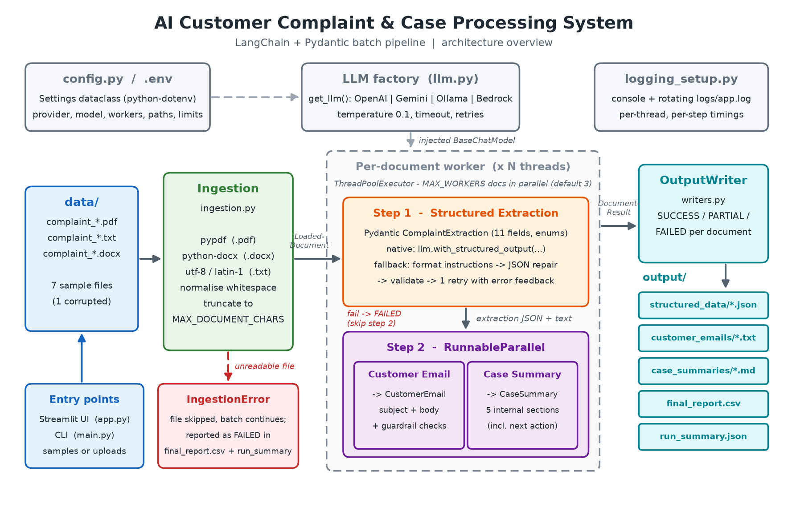
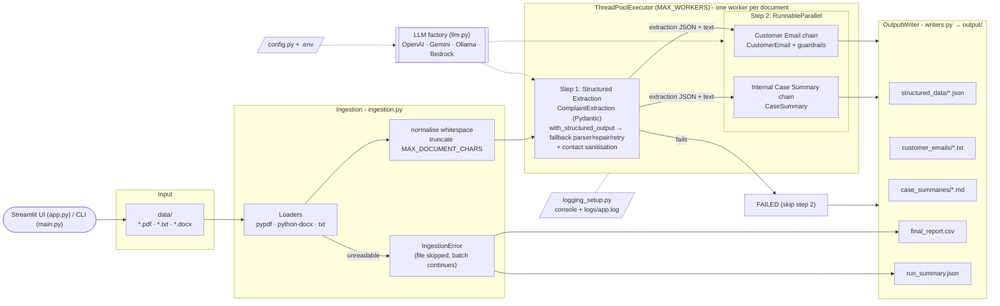

# AI Customer Complaint & Case Processing System

> **IIT Patna – GenAI Development Program · Capstone Project 1**
> Author: **Saurabh Goyal**
>
> **Live demo:** http://15.207.159.211 (Streamlit web UI on AWS EC2, powered by Amazon Bedrock Nova 2 Lite)

A batch pipeline built with LangChain and Pydantic. It reads customer complaint documents (PDF, TXT, DOCX) and turns each one into three outputs:

1. **Structured case data**: 11 validated fields (contact details, category, Yes/No flags, status)
2. **A customer reply email**: professional, empathetic and grounded in the document
3. **An internal case summary**: overview, key issue, action taken, status and recommended next action

The run also writes a consolidated `final_report.csv` and a machine-readable `run_summary.json`. The pipeline is provider-agnostic. It works with **OpenAI**, **Google Gemini**, **Amazon Bedrock** (e.g. Nova 2 Lite or Claude on Bedrock) or a **fully local Ollama** model. The sample outputs committed in this repo come from local `glm-4.7-flash`, with no API key. The same batch on Bedrock Nova 2 Lite took **8.6 s instead of 127.4 s** (see [Provider comparison](#provider-comparison-ollama-local-vs-amazon-bedrock)).

Besides the CLI there is a **Streamlit web UI** (`app.py`), packaged with Docker and deployed on **AWS EC2**, calling Bedrock through an IAM instance role, so no API keys live on the server.

---

## Table of Contents

1. [Problem Statement](#1-problem-statement)
2. [Solution Overview](#2-solution-overview)
3. [Architecture](#3-architecture)
4. [Technology Stack](#4-technology-stack)
5. [Project Structure](#5-project-structure)
6. [Setup](#6-setup)
7. [Environment Variables](#7-environment-variables)
8. [How to Run](#8-how-to-run)
9. [Web UI (Streamlit)](#9-web-ui-streamlit)
10. [Deployment (AWS)](#10-deployment-aws)
11. [Sample Inputs](#11-sample-inputs)
12. [Sample Outputs (real run)](#12-sample-outputs-real-run)
13. [Workflow Design](#13-workflow-design)
14. [Prompt Engineering & Hallucination Controls](#14-prompt-engineering--hallucination-controls)
15. [Error Handling](#15-error-handling)
16. [Logging](#16-logging)
17. [Testing](#17-testing)
18. [Key Design Decisions](#18-key-design-decisions)
19. [Limitations & Future Improvements](#19-limitations--future-improvements)
20. [Mapping to Evaluation Requirements](#20-mapping-to-evaluation-requirements)

---

## 1. Problem Statement

Customer-support teams receive complaints through many channels: web forms, emails, chat transcripts and call notes. These arrive in mixed formats (PDF, Word, plain text). For every case an agent has to:

- read the document and pull out the customer's details and the core issue,
- classify it (category, is it really a complaint, does it need escalation, is there evidence, what is the status),
- write a polite, accurate reply to the customer, and
- write an internal hand-over note for colleagues.

Doing this by hand is slow and inconsistent, and mistakes happen easily: a wrong phone number, a promised refund that was never approved, a missed escalation. The goal is to **automate this workflow reliably**. The system must process a whole folder of documents and produce structured, validated and grounded outputs. One bad file must not stop the batch.

## 2. Solution Overview

| Stage | What happens | Code |
|---|---|---|
| **Ingestion** | Discover `.pdf/.txt/.docx` files in `data/`, extract text (pypdf / python-docx / UTF-8 with latin-1 fallback), normalise whitespace and truncate to `MAX_DOCUMENT_CHARS`. Unreadable files become `IngestionError` records. | `ingestion.py` |
| **Task 1 – Extraction** | LLM returns a validated `ComplaintExtraction` Pydantic model, using native structured output with a repair/retry fallback. Contact details that do not appear in the source are nulled. | `chains.py`, `prompts.py`, `schemas.py` |
| **Task 2 & 3 – Email + Summary** | Run **concurrently** through a LangChain `RunnableParallel`, both grounded on the document plus the extraction JSON. The email is checked by guardrails. | `pipeline.py`, `chains.py` |
| **Batch parallelism** | Documents are processed concurrently in a `ThreadPoolExecutor` (`MAX_WORKERS`). Results keep input order. | `pipeline.py` |
| **Outputs** | Per-document JSON, email `.txt` and summary `.md` files, plus `final_report.csv` and `run_summary.json`. | `writers.py` |
| **CLI** | Flags override `.env`. Prints a console summary table and returns a meaningful exit code. | `cli.py`, `main.py` |
| **Web UI** | Streamlit app: sample or uploaded documents, metrics, report table, per-document tabs, CSV and zip downloads. | `app.py` |
| **Deployment** | Docker image on AWS EC2, Bedrock via an IAM instance role, one-command redeploy. | `Dockerfile`, `deploy/` |

## 3. Architecture



*(Regenerate with `.venv/bin/python scripts/render_architecture.py`.)*



## 4. Technology Stack

| Concern | Technology |
|---|---|
| Language | Python 3.10+ (developed and tested on 3.11) |
| LLM orchestration | `langchain-core` 0.3 (`ChatPromptTemplate`, `RunnableLambda`, `RunnableParallel`, `with_structured_output`, `PydanticOutputParser`) |
| LLM providers | `langchain-openai` (`ChatOpenAI`), `langchain-google-genai` (`ChatGoogleGenerativeAI`), `langchain-ollama` (`ChatOllama`), `langchain-aws` (`ChatBedrockConverse`, Amazon Bedrock Converse API via `boto3`) |
| Schemas / validation | Pydantic v2 (enums, field validators) |
| Document parsing | `pypdf`, `python-docx`, built-in text I/O |
| Reporting | `pandas` (CSV), `json` |
| Concurrency | `concurrent.futures.ThreadPoolExecutor` + LangChain `RunnableParallel` |
| Config | `python-dotenv` + frozen `dataclass` settings |
| Logging | stdlib `logging` with a `RotatingFileHandler` |
| Testing | `pytest`, LangChain `FakeListChatModel` (fully offline) |
| Web UI | `streamlit` (`app.py`, theme and server settings in `.streamlit/config.toml`) |
| Packaging / cloud | Docker (`python:3.11-slim`), AWS EC2 (t4g.small, Amazon Linux 2023, arm64), Amazon Bedrock, IAM instance role, AWS Systems Manager (SSM) |
| Sample data / docs | `reportlab` (sample PDFs), `matplotlib` (architecture diagram) |

## 5. Project Structure

```
complaint-case-processor/
├── main.py                       # CLI entry point: python main.py [options]
├── app.py                        # Streamlit web UI: streamlit run app.py
├── .streamlit/config.toml        # Streamlit theme + server settings (upload size, XSRF, no telemetry)
├── requirements.txt
├── .env.example                  # template for .env (copy and fill in)
├── Dockerfile                    # python:3.11-slim, non-root, healthcheck, Streamlit on :8501
├── .dockerignore
├── deploy/
│   ├── ec2_user_data.sh          # EC2 bootstrap: install Docker, clone repo, build + run on :80
│   └── redeploy.sh               # git pull, rebuild image, restart container (run on the host / via SSM)
├── data/                         # input documents (7 samples)
│   ├── complaint_001.pdf … complaint_006.txt
│   └── corrupted_007.pdf         # deliberately unreadable
├── docs/
│   ├── architecture.png          # rendered by scripts/render_architecture.py
│   └── Capstone_Presentation.pptx  # built by scripts/build_presentation.py
├── scripts/
│   ├── generate_sample_data.py   # (re)creates data/ with fictional complaints
│   ├── render_architecture.py    # draws docs/architecture.png with matplotlib
│   └── build_presentation.py     # builds docs/Capstone_Presentation.pptx
├── src/complaint_processor/
│   ├── __main__.py               # python -m complaint_processor
│   ├── cli.py                    # argparse CLI, orchestration, console table, exit codes
│   ├── config.py                 # Settings dataclass from env / .env
│   ├── llm.py                    # LLM factory (openai | gemini | ollama | bedrock)
│   ├── ingestion.py              # file discovery + text extraction + IngestionError
│   ├── schemas.py                # Pydantic models & enums (the data contract)
│   ├── prompts.py                # the 3 ChatPromptTemplates
│   ├── chains.py                 # structured-output calls, JSON repair, guardrails, chains
│   ├── pipeline.py               # per-document task graph + parallel batch runner
│   ├── writers.py                # JSON / email / summary / CSV / run summary writers
│   └── logging_setup.py          # console + rotating file logging
├── tests/
│   ├── test_ingestion.py         # 8 tests
│   ├── test_chains.py            # 13 tests
│   ├── test_pipeline.py          # 7 tests
│   └── test_app.py               # web UI processing logic
├── output/                       # generated (real run included)
│   ├── structured_data/          # complaint_00X.json
│   ├── customer_emails/          # complaint_00X_email.txt
│   ├── case_summaries/           # complaint_00X_summary.md
│   ├── final_report.csv
│   └── run_summary.json
└── logs/app.log                  # generated at runtime (git-ignored)
```

## 6. Setup

**Prerequisites:** Python **3.10+**. You also need one of the following: an OpenAI API key, a Google AI (Gemini) API key, AWS credentials with Amazon Bedrock access, or a local [Ollama](https://ollama.com) install.

### Option A: venv + pip

```bash
git clone <repo-url> complaint-case-processor
cd complaint-case-processor
python3 -m venv .venv
source .venv/bin/activate            # Windows: .venv\Scripts\activate
pip install -r requirements.txt
cp .env.example .env                 # then edit .env
```

### Option B: uv (optional, faster)

```bash
uv venv .venv
uv pip install -p .venv/bin/python -r requirements.txt
cp .env.example .env
```

### For local models (Ollama)

```bash
ollama pull llama3.1                 # default model for the ollama provider
# or the model used for the sample run:
ollama pull glm-4.7-flash
```

### For Amazon Bedrock

No API key is used. `ChatBedrockConverse` (through `boto3`) reads credentials from the **standard AWS credential chain**: environment variables, an AWS CLI profile locally, or the IAM instance role on EC2.

```bash
aws configure --profile capstone          # or: aws sso login --profile capstone
export AWS_PROFILE=capstone
export AWS_REGION=ap-south-1              # default region used by the app
```

The identity needs `bedrock:InvokeModel` / `bedrock:Converse` for the chosen model. The default model `global.amazon.nova-2-lite-v1:0` works as soon as Bedrock is enabled for the account. Claude on Bedrock (e.g. `global.anthropic.claude-haiku-4-5-20251001-v1:0`) also works, but only after the account's one-time Anthropic use-case form has been submitted in the Bedrock console.

## 7. Environment Variables

All settings are read in `config.py`, with `.env` supported through `python-dotenv`. CLI flags override them. See [`.env.example`](.env.example).

| Variable | Default | Description |
|---|---|---|
| `LLM_PROVIDER` | `openai` | `openai` \| `gemini` \| `ollama` \| `bedrock` |
| `MODEL_NAME` | *(empty → provider default)* | Defaults: `gpt-4o-mini` (openai), `gemini-2.0-flash` (gemini), `llama3.1` (ollama), `global.amazon.nova-2-lite-v1:0` (bedrock) |
| `OPENAI_API_KEY` | – | Required when `LLM_PROVIDER=openai` (checked by `Settings.validate()`) |
| `GOOGLE_API_KEY` | – | Required when `LLM_PROVIDER=gemini` |
| `OLLAMA_BASE_URL` | `http://localhost:11434` | Ollama server URL |
| `AWS_REGION` | `ap-south-1` | Bedrock region (used when `LLM_PROVIDER=bedrock`) |
| `AWS_PROFILE` | – | *Read by boto3, not by `config.py`.* Selects a local AWS CLI profile. Leave unset on EC2, where the IAM instance role is used |
| `LLM_TEMPERATURE` | `0.1` | Low temperature for factual, repeatable output |
| `LLM_TIMEOUT_SECONDS` | `120` | Per-request timeout (all providers; the botocore read timeout on Bedrock) |
| `LLM_MAX_RETRIES` | `2` | Provider SDK retries for transient errors (OpenAI / Gemini; on Bedrock, botocore `max_attempts = retries + 1`, standard mode) |
| `DATA_DIR` | `data` | Input folder, relative to the project root |
| `OUTPUT_DIR` | `output` | Output folder, relative to the project root |
| `MAX_WORKERS` | `3` | Documents processed in parallel (must be ≥ 1) |
| `MAX_DOCUMENT_CHARS` | `12000` | Text longer than this is truncated, with a warning in the log |
| `LOG_LEVEL` | `INFO` | `DEBUG` \| `INFO` \| `WARNING` \| `ERROR` |

## 8. How to Run

```bash
# (optional) regenerate the 7 sample documents in data/
python scripts/generate_sample_data.py

# run with settings from .env
python main.py
```

### CLI flags

| Flag | Overrides | Example |
|---|---|---|
| `--provider {openai,gemini,ollama,bedrock}` | `LLM_PROVIDER` (resets the model to the provider default unless `--model` is given) | `--provider ollama` |
| `--model NAME` | `MODEL_NAME` | `--model gpt-4o-mini` |
| `--workers N` | `MAX_WORKERS` | `--workers 4` |
| `--data-dir PATH` | `DATA_DIR` | `--data-dir ./my_inbox` |
| `--output-dir PATH` | `OUTPUT_DIR` | `--output-dir ./out` |
| `--limit N` | – | only the first N documents, sorted by name |
| `--log-level LEVEL` | `LOG_LEVEL` | `--log-level DEBUG` |

### Examples

```bash
# OpenAI (needs OPENAI_API_KEY in .env or the environment)
python main.py --provider openai --model gpt-4o-mini

# Google Gemini (needs GOOGLE_API_KEY)
python main.py --provider gemini --model gemini-2.0-flash

# Fully local with Ollama: exactly the configuration of the included sample run
python main.py --provider ollama --model glm-4.7-flash --workers 3

# Amazon Bedrock with the default model (Nova 2 Lite); credentials from AWS_PROFILE / the AWS chain
AWS_PROFILE=capstone python main.py --provider bedrock --workers 4

# Claude Haiku 4.5 on Bedrock (needs the Anthropic use-case form submitted for the account)
python main.py --provider bedrock --model global.anthropic.claude-haiku-4-5-20251001-v1:0

# Quick smoke test on 2 documents with verbose logs
python main.py --provider ollama --limit 2 --log-level DEBUG

# Module form
PYTHONPATH=src python -m complaint_processor --help
```

**Exit codes:** `0` if at least one document was processed (success or partial). `1` for a fatal config or LLM-initialisation error, a missing data directory, or an invalid `--limit`. `2` if nothing could be processed.

## 9. Web UI (Streamlit)

`app.py` wraps the same pipeline in a browser UI. It is the app behind the [live demo](#10-deployment-aws).

```bash
PYTHONPATH=src streamlit run app.py
# then open http://localhost:8501
```

The provider and model come from the server configuration (`.env` / environment), exactly as for the CLI. For example, `LLM_PROVIDER=bedrock AWS_PROFILE=capstone PYTHONPATH=src streamlit run app.py`.

What the UI does:

1. **Choose documents.** Either *Use sample documents* (the 7 files in `data/`, with a text preview) or *Upload your own* (TXT / PDF / DOCX, up to 5 files, 2 MB each).
2. **Process.** A slider sets the parallel workers (1–4). The run calls the same `CaseProcessingPipeline` and `OutputWriter` as the CLI, in a per-session temporary folder.
3. **Results.** Metrics (total, success, partial, failed, total time), the consolidated report table, **download buttons for `final_report.csv` and a zip of all outputs**, and one expander per document with tabs for *Structured data*, *Customer email* and *Case summary*. Unreadable files are shown as errors. The rest of the batch still completes.

Because the demo is public, `app.py` has some guard rails: a **per-session run limit** (10 runs), a **global semaphore** that allows at most 2 runs at the same time (other users get a "server busy" message), upload count, type and size checks, and friendly error messages instead of tracebacks. The processing logic sits in a plain function (`run_processing`), so `tests/test_app.py` can test it without a browser.

## 10. Deployment (AWS)

**Live demo:** http://15.207.159.211

```
Browser ──HTTP :80──► EC2 t4g.small (Amazon Linux 2023, arm64, ap-south-1)
                        └─ Docker container "complaint-app" (python:3.11-slim, non-root)
                             └─ Streamlit app.py :8501  (host :80 → container :8501)
                                  └─ CaseProcessingPipeline (extraction → email ‖ summary)
                                       └─ ChatBedrockConverse ──► Amazon Bedrock (Nova 2 Lite)
                                            credentials: IAM instance role (no keys on the server)

GitHub (public repo) ──git clone / git pull──► EC2 user-data / deploy/redeploy.sh ──► docker build + run
```

| Piece | Details |
|---|---|
| Image | `Dockerfile`: `python:3.11-slim`, installs `requirements.txt`, runs as non-root `appuser`, `HEALTHCHECK` on `/_stcore/health`, `CMD streamlit run app.py` on port 8501. Defaults `LLM_PROVIDER=bedrock`, `AWS_REGION=ap-south-1`. `.dockerignore` keeps `.env`, `.venv`, `logs/` and the pptx out of the image |
| Host | EC2 **t4g.small** (Graviton, arm64), Amazon Linux 2023, region **ap-south-1** (Mumbai) |
| Bootstrap | `deploy/ec2_user_data.sh`: installs Docker and git, clones the public GitHub repo to `/opt/complaint-app`, installs `redeploy.sh` as `/usr/local/bin/redeploy-complaint-app` and runs it |
| Run | `deploy/redeploy.sh`: `git pull --ff-only`, `docker build`, then `docker run -d --restart unless-stopped -p 80:8501 -e LLM_PROVIDER=bedrock -e AWS_REGION=ap-south-1 -e MAX_WORKERS=4` |
| Credentials | IAM role with an inline policy allowing only the Bedrock invoke actions, plus the managed `AmazonSSMManagedInstanceCore` policy. No API keys or `.env` on the server |
| Network | Security group opens inbound TCP **80**. No SSH port is needed, since administration goes through SSM |
| Redeploy | Run `redeploy-complaint-app` on the host, triggered remotely with **SSM Run Command** |

### Step-by-step (AWS CLI)

```bash
export AWS_REGION=ap-south-1

# 1. IAM role for the instance: least-privilege Bedrock invoke (deploy/bedrock-invoke-policy.json) + SSM
#    (replace the account id in deploy/bedrock-invoke-policy.json with your own)
aws iam create-role --role-name complaint-app-ec2-role \
  --assume-role-policy-document file://deploy/ec2-trust-policy.json
aws iam put-role-policy --role-name complaint-app-ec2-role --policy-name bedrock-invoke \
  --policy-document file://deploy/bedrock-invoke-policy.json
aws iam attach-role-policy --role-name complaint-app-ec2-role \
  --policy-arn arn:aws:iam::aws:policy/AmazonSSMManagedInstanceCore
aws iam create-instance-profile --instance-profile-name complaint-app-ec2-profile
aws iam add-role-to-instance-profile --instance-profile-name complaint-app-ec2-profile \
  --role-name complaint-app-ec2-role

# 2. Security group allowing HTTP (default VPC)
VPC_ID=$(aws ec2 describe-vpcs --filters Name=isDefault,Values=true --query 'Vpcs[0].VpcId' --output text)
SG_ID=$(aws ec2 create-security-group --group-name complaint-app-sg --vpc-id "$VPC_ID" \
  --description "Capstone complaint app HTTP" --query GroupId --output text)
aws ec2 authorize-security-group-ingress --group-id "$SG_ID" --protocol tcp --port 80 --cidr 0.0.0.0/0

# 3. Launch the instance (latest Amazon Linux 2023 arm64 AMI) with the user-data bootstrap.
#    HttpPutResponseHopLimit=2 lets the Docker container reach the instance-role credentials (IMDSv2).
AMI_ID=$(aws ssm get-parameter \
  --name /aws/service/ami-amazon-linux-latest/al2023-ami-kernel-default-arm64 \
  --query Parameter.Value --output text)
INSTANCE_ID=$(aws ec2 run-instances --image-id "$AMI_ID" --instance-type t4g.small \
  --iam-instance-profile Name=complaint-app-ec2-profile --security-group-ids "$SG_ID" \
  --user-data file://deploy/ec2_user_data.sh \
  --metadata-options HttpTokens=required,HttpPutResponseHopLimit=2 \
  --block-device-mappings 'DeviceName=/dev/xvda,Ebs={VolumeSize=16,VolumeType=gp3}' \
  --tag-specifications 'ResourceType=instance,Tags=[{Key=Name,Value=complaint-app}]' \
  --query 'Instances[0].InstanceId' --output text)

# 4. Attach a static Elastic IP. The app is up at http://<PUBLIC_IP> ~2-3 minutes later (image build)
aws ec2 wait instance-running --instance-ids "$INSTANCE_ID"
ALLOC_ID=$(aws ec2 allocate-address --domain vpc --query AllocationId --output text)
aws ec2 associate-address --instance-id "$INSTANCE_ID" --allocation-id "$ALLOC_ID"
aws ec2 describe-addresses --allocation-ids "$ALLOC_ID" --query 'Addresses[0].PublicIp' --output text

# 5. Redeploy after pushing new commits to GitHub (no SSH needed)
aws ssm send-command --instance-ids "$INSTANCE_ID" --document-name AWS-RunShellScript \
  --parameters 'commands=["/usr/local/bin/redeploy-complaint-app"]'
```

Before the first run, Bedrock must be available for the account in `ap-south-1`. Nova 2 Lite is called through the `global.` cross-region inference profile. Verified live deployment: a batch run inside the container on EC2 processed the 6 sample documents in 6.9 s (1 corrupted file reported as failed).

## 11. Sample Inputs

`scripts/generate_sample_data.py` creates seven fictional documents for the company "BrightWave Electronics & Broadband Ltd.". Together they cover every category of behaviour the pipeline must handle:

| File | Format / layout | Scenario | What it tests |
|---|---|---|---|
| `complaint_001.pdf` | PDF form with key/value tables | Double-billed broadband invoice. Refund issued, customer satisfied | **Billing**. Resolution *already provided*. Attachments present. Status Resolved/Closed. No escalation |
| `complaint_002.pdf` | PDF with an embedded customer email | Laptop fails again after a motherboard repair. Customer demands a manager and threatens the consumer forum | **Product Defect**. **Escalation = Yes** (manager + legal threat). Photos/video attached. No resolution yet |
| `complaint_003.txt` | Plain-text call notes | Repeated broadband outages. Technician visit scheduled | **Technical Issue**. **In Progress**. "No attachments" stated explicitly. Contains the customer's address, which must not leak into invented facts |
| `complaint_004.docx` | Word document with 3 tables | TV delivery 12 days late. Case escalated per policy | **Delivery**. DOCX **table extraction in document order**. **Escalated** status |
| `complaint_005.pdf` | PDF | Refund not received after 5 weeks and 4 contacts. Phone "Not provided" | **Refund**. Escalated. **Missing phone → must be null**, not invented |
| `complaint_006.txt` | Plain-text email + internal note | Compliment plus a plan question. Ticket closed | **Not a complaint** (`is_complaint = No`). Category Other. **Closed** |
| `corrupted_007.pdf` | Random bytes with a PDF header | – | **Ingestion failure isolation**: logged, reported as `failed`, batch continues |

## 12. Sample Outputs (real run)

All excerpts below are copied verbatim from `output/`. They were produced by a real run with **local Ollama `glm-4.7-flash`** and **3 workers**. Result: **6 success, 0 partial, 1 failed** (the corrupted file), in **127.4 s** total. Each document took about 58 s on average, and the documents ran concurrently.

### Console summary

The table printed at the end of the run. It was reproduced from the saved results with `cli.print_summary_table`, and the absolute path is shortened.

```
Provider: ollama  Model: glm-4.7-flash:latest  Workers: 3
+--------------------+---------+-----------------+----------+-------+----------------------------------------------------------+
| File               | Status  | Category        | Escalate | Time  | Error                                                    |
+--------------------+---------+-----------------+----------+-------+----------------------------------------------------------+
| complaint_001.pdf  | SUCCESS | Billing         | No       | 60.1s |                                                          |
| complaint_002.pdf  | SUCCESS | Product Defect  | Yes      | 73.2s |                                                          |
| complaint_003.txt  | SUCCESS | Technical Issue | No       | 47.7s |                                                          |
| complaint_004.docx | SUCCESS | Delivery        | Yes      | 55.0s |                                                          |
| complaint_005.pdf  | SUCCESS | Refund          | Yes      | 57.7s |                                                          |
| complaint_006.txt  | SUCCESS | Other           | No       | 54.0s |                                                          |
| corrupted_007.pdf  | FAILED  | -               | -        | 0.0s  | ingestion: PdfStreamError: Stream has ended unexpectedly |
+--------------------+---------+-----------------+----------+-------+----------------------------------------------------------+
Total: 7  Success: 6  Partial: 0  Failed: 1  Time: 127.4s
Outputs written to: .../complaint-case-processor/output
```

### `final_report.csv` (key columns)

The full CSV has 17 columns: `doc_id, file_name, status, customer_name, email, phone_number, complaint_category, is_complaint, escalation_required, supporting_document_available, overall_case_status, product_or_service, issue_description, resolution_provided, email_subject, duration_seconds, errors`.

| file_name | status | customer_name | phone_number | complaint_category | is_complaint | escalation_required | supporting_document_available | overall_case_status | email_subject |
|---|---|---|---|---|---|---|---|---|---|
| complaint_001.pdf | success | Arjun Mehta | +91 98765 40001 | Billing | Yes | No | Yes | Closed | Update on your billing concern - FiberMax 300 Mbps |
| complaint_002.pdf | success | Sneha Kulkarni | +91 91234 50002 | Product Defect | Yes | Yes | Yes | Open | Update on your defective NovaBook 14 - Case BW-CMP-2026-002 |
| complaint_003.txt | success | Meera Iyer | +91 99887 60003 | Technical Issue | Yes | No | No | In Progress | Update on your broadband connectivity issue - Case BW-CMP-2026-003 |
| complaint_004.docx | success | Daniel D'Souza | +91 90000 70004 | Delivery | Yes | Yes | Yes | Escalated | Update on your delivery concern - Order BW-ORD-771045 |
| complaint_005.pdf | success | Kavita Singh | *(empty)* | Refund | Yes | Yes | Yes | Escalated | Update on your refund request - BW-CMP-2026-005 |
| complaint_006.txt | success | Rohan Kapoor | +91 98111 80006 | Other | No | No | No | Closed | Update on your inquiry regarding BrightWave TV+ |
| corrupted_007.pdf | failed | | | | | | | | |

The `errors` column for `corrupted_007.pdf` reads `ingestion failed: PdfStreamError: Stream has ended unexpectedly`.

Note `complaint_005`: the document says *Phone: Not provided*, and the model correctly returned `null` instead of inventing a number.

### `structured_data/complaint_001.json`

```json
{
  "doc_id": "complaint_001",
  "file_name": "complaint_001.pdf",
  "status": "success",
  "extraction": {
    "customer_name": "Arjun Mehta",
    "email": "arjun.mehta@example.com",
    "phone_number": "+91 98765 40001",
    "product_or_service": "FiberMax 300 Mbps Broadband Plan",
    "complaint_category": "Billing",
    "issue_description": "The customer's August 2026 invoice shows a charge of Rs. 2,398, which is double the standard monthly rate of Rs. 1,199, due to a duplicate plan line entry.",
    "resolution_provided": "A refund of Rs. 1,199 was processed (refund ref RF-77120) and a corrected invoice was issued.",
    "is_complaint": "Yes",
    "escalation_required": "No",
    "supporting_document_available": "Yes",
    "overall_case_status": "Closed"
  },
  "errors": [],
  "duration_seconds": 60.074
}
```

### `customer_emails/complaint_004_email.txt`

```text
Subject: Update on your delivery concern - Order BW-ORD-771045

Dear Daniel D'Souza,

Thank you for contacting BrightWave Electronics & Broadband Ltd. regarding your delayed delivery of the BrightWave Vista 55" 4K Smart TV.

I understand you are experiencing significant frustration as your order, which was promised for delivery by 31 August, is now twelve days late. The tracking status shows the package has been held at the Pune hub for ten days, and you have been unable to receive it for your family event on 14 September.

I sincerely apologise for this inconvenience and the lack of communication regarding the delay. I have reviewed your case and escalated it to our Logistics Escalations Desk and Regional Operations Manager to investigate the hold at the hub immediately. We are actively working to resolve this issue for you.

Kind regards,
Customer Care Team, BrightWave Electronics & Broadband Ltd.
```

The email does not promise the firm delivery date, compensation or refund that the customer asked for, because the document does not say any of them was approved. This is the email prompt's "no unapproved promises" rule working.

### `case_summaries/complaint_004_summary.md`

```markdown
# Case Summary: complaint_004

| Field | Value |
|---|---|
| Source file | complaint_004.docx |
| Customer | Daniel D'Souza |
| Category | Delivery |
| Product / Service | BrightWave Vista 55" 4K Smart TV + wall-mount kit |
| Escalation required | Yes |
| Case status | Escalated |

## Case Overview

Customer Daniel D'Souza filed a complaint regarding a delayed delivery of a BrightWave Vista 55" 4K Smart TV for a family event.

## Key Issue

The order, promised for 31 August, is twelve days late with tracking showing 'held at hub' status since 02 September.

## Action Taken

A trace request was raised with SwiftShip Logistics on 12 September. The case has been escalated to the Logistics Escalations Desk and the Regional Operations Manager due to the delay exceeding seven days and multiple customer contacts.

## Current Status

Escalated - No resolution confirmed to the customer.

## Recommended Next Action

The Logistics Escalations Desk should contact SwiftShip Logistics to obtain a specific delivery timeline for the Pune hub and communicate a firm date to the customer. If the delay cannot be resolved within 48 hours, the Regional Operations Manager should authorize a refund or cancellation as requested by the customer.
```

Every reason in the recommendation comes from the document: the 48-hour window the customer was repeatedly promised, and the refund or cancellation they asked for. An earlier run had invented a chargeback threat here. See [Limitations](#19-limitations--future-improvements) for how the prompt was fixed.

### `run_summary.json`

```json
{
  "timestamp": "2026-09-23T18:24:30+00:00",
  "provider": "ollama",
  "model": "glm-4.7-flash:latest",
  "max_workers": 3,
  "total_files": 7,
  "documents_processed": 6,
  "ingestion_failures": 1,
  "success": 6,
  "partial": 0,
  "failed": 1,
  "total_seconds": 127.4,
  "avg_seconds_per_document": 57.96,
  "ingestion_errors": [
    { "file_name": "corrupted_007.pdf", "error": "PdfStreamError: Stream has ended unexpectedly" }
  ]
}
```

The sum of per-document times is about 348 s, but wall-clock time was 127.4 s. This speed-up of roughly 2.7× comes from the two levels of parallelism described below.

### Provider comparison: Ollama (local) vs Amazon Bedrock

The same 7 documents were also run on **Amazon Bedrock** with the default model, `python main.py --provider bedrock --workers 4` (region `ap-south-1`). That run's outputs are not committed. The files in `output/` are from the Ollama run above.

| | Ollama (local) | Amazon Bedrock |
|---|---|---|
| Model | `glm-4.7-flash` | `global.amazon.nova-2-lite-v1:0` (Nova 2 Lite) |
| Where it runs | Laptop, no API key | AWS managed API, IAM / AWS profile credentials |
| Workers | 3 | 4 |
| Result | 6 success, 0 partial, 1 failed | 6 success, 0 partial, 1 failed |
| **Total wall-clock time** | **127.4 s** | **8.6 s** (about 15× faster) |
| Avg time per document | ~58 s | ~4.2 s |

The failed file is `corrupted_007.pdf` in both runs. Name, email, phone, category, `is_complaint`, escalation and supporting-document values were identical for all six documents (including `null` phone for `complaint_005`). Differences were minor: Nova put serial or connection IDs into `product_or_service` for two documents, and marked `complaint_001` as `Resolved` rather than `Closed`, which is the ambiguous "Resolved - closed" wording discussed in [Limitations](#19-limitations--future-improvements). The live demo uses Bedrock Nova 2 Lite.

## 13. Workflow Design

### The three AI tasks

| # | Task | Input | Output (Pydantic) | Prompt |
|---|---|---|---|---|
| 1 | Structured extraction | document text | `ComplaintExtraction`: 11 fields, 4 enums (`ComplaintCategory`, `YesNo`, `CaseStatus`), email normalised by a validator | `EXTRACTION_PROMPT` |
| 2 | Customer reply email | document text + extraction JSON | `CustomerEmail` (`subject`, `body`) | `EMAIL_PROMPT` |
| 3 | Internal case summary | document text + extraction JSON | `CaseSummary` (`case_overview`, `key_issue`, `action_taken`, `current_status`, `recommended_next_action`) | `SUMMARY_PROMPT` |

### Why separate LLM calls instead of one mega-prompt?

- **Different audiences and tones.** The email is customer-facing and empathetic. The summary is internal, neutral and third-person. The extraction is purely analytical. Mixing all three in one prompt blurs the instructions.
- **Validated facts feed generation.** Tasks 2 and 3 receive the *validated and sanitised* extraction as JSON next to the original text. The email therefore uses the same name, category and status that appear in the CSV, so the three outputs stay consistent.
- **Smaller schemas are more reliable.** Small and local models fill a small schema far more accurately than one nested schema with 18+ fields.
- **Failure isolation.** If the summary fails, the extraction and email are still saved, and the document is marked `partial` instead of losing everything.
- **Easier testing.** Each chain can be tested and monkeypatched on its own.

### Per-document task graph (`pipeline.py`)

```
document text
    │
    ▼
[1] extract_case ──(fails)──► status = FAILED (downstream skipped)
    │ ComplaintExtraction
    ▼
RunnableParallel ─┬─ [2] generate_customer_email ─► CustomerEmail
                  └─ [3] generate_case_summary   ─► CaseSummary
    │
    ▼
SUCCESS (both ok)  /  PARTIAL (one or both failed)
```

Each branch of the `RunnableParallel` is wrapped in `_run_guarded`, which returns a `TaskOutcome` (value or error, plus timing) instead of raising. As a result, a failing branch never cancels its sibling.

### Parallelism at two levels

1. **Across documents:** `CaseProcessingPipeline.run_batch` submits every document to a `ThreadPoolExecutor(max_workers=MAX_WORKERS, thread_name_prefix="doc-worker")`. Results are collected with `as_completed` and then **returned in input order**.
2. **Within a document:** after extraction, the email and summary chains run concurrently in a LangChain `RunnableParallel`. This is verified by `test_email_and_summary_run_in_parallel`, which uses a `threading.Barrier` that would time out if the two branches ran sequentially.

LLM calls are I/O-bound, so threads give real speed-ups without multiprocessing overhead.

## 14. Prompt Engineering & Hallucination Controls

**Prompt design (`prompts.py`)**

- Each prompt is a `ChatPromptTemplate` with a **role-specific system message** (case analyst, senior customer-care representative, support operations lead) and a human message. The source text is wrapped in `<document>…</document>` delimiters, and the extraction in `<extracted_case_data>…</extracted_case_data>`.
- **Explicit field definitions and decision rules.** The extraction prompt defines each of the 8 categories, each Yes/No flag and each status. It also sets a **status precedence rule** (`Closed > Resolved > Escalated > In Progress > Open`). `Closed` explicitly covers wording such as "Resolved - closed" and "ticket closed". There is also a tie-breaker for choosing between Refund and Product Defect.
- **"null, not N/A".** Missing fields must be `null`. A customer's *request* is explicitly **not** a `resolution_provided`.
- The email prompt fixes the structure (acknowledge → restate the issue → current status → apology), the length (about 120–220 words), the greeting rule and an exact sign-off.
- The summary prompt requires internal, third-person, factual text. It must state "No action recorded in the document." when nothing was done, and it must phrase the next action as a *recommendation*. **Any reason given for the recommendation must be a fact stated in the document.** The model must never attribute threats, demands or feelings to the customer that the document does not contain. The `current_status` example is a neutral template (`"<status> - <short qualifier taken from the document>"`), not a concrete sentence the model could copy.
- `LLM_TEMPERATURE=0.1` by default.

**Structured output with a robust fallback (`chains.structured_call`)**

1. **Native** `llm.with_structured_output(Model)`. On Ollama this uses `method="json_schema"`, which gives grammar-constrained decoding. OpenAI and Gemini use their provider defaults.
2. If that raises for any reason, a **fallback** runs. It adds `PydanticOutputParser` format instructions, then repairs the raw text: it strips `<think>` blocks (including an orphan `</think>`), removes code fences, pulls out the first balanced `{...}` with a string-aware brace matcher, drops trailing commas and unwraps single-key wrappers such as `{"ComplaintExtraction": {...}}`. The result is then validated with Pydantic.
3. On a validation failure, the fallback makes **one retry**. The retry sends the model its previous reply together with the validation error, and asks for a corrected JSON object with the exact enum values.
4. Ollama reasoning models run with `reasoning=False` (see `llm.py`), which keeps thinking tokens out of the JSON.

**Guardrails against hallucinated facts**

- **Extraction sanitisation (`_sanitise_extraction`).** An extracted email that does not appear in the document (case-insensitive), or a phone number whose digits do not appear in the document's digits, is **set to `null`** and a warning is logged.
- **Email guardrails (`check_email_guardrails`).** These flag email addresses and phone numbers in the generated email that are not in the source, and unfilled placeholders such as `[Customer Name]` or `<date>`. Violations are logged as `WARNING`s so a reviewer can find them. The email itself is kept.
- **Prompt-level rules.** The email must not promise refunds, compensation, dates or reference numbers unless the document states them. Only facts from the document or case data may be used.
- **Schema-level constraints.** Enums make invalid categories, flags and statuses impossible. The `email` validator lowercases the address and rejects values without an `@`.

## 15. Error Handling

| Failure | Where handled | Behaviour |
|---|---|---|
| Missing or invalid config (unknown provider, missing API key, `MAX_WORKERS < 1`) | `Settings.validate()` → `cli.main` | Clear message on stderr, exit code `1` |
| LLM client fails to initialise | `cli.main` | Logged, exit code `1` |
| Data directory missing | `cli.main` / `load_documents` | Exit code `1` / `FileNotFoundError` |
| Unreadable, corrupted, encrypted or empty file | `ingestion.load_documents` | Captured as `IngestionError`. Listed as `failed` in the CSV, `run_summary.json` and console table. Batch continues |
| Unsupported extension / hidden file | `load_documents` | Skipped (unsupported extensions logged at INFO) |
| Non-UTF-8 text file | `_extract_txt` | Falls back to latin-1 |
| Encrypted PDF | `_extract_pdf` | Tries an empty-password decrypt, otherwise a clear error |
| Oversized document | `load_documents` | Truncated to `MAX_DOCUMENT_CHARS`, logged as a WARNING |
| Transient API errors or timeouts | provider SDKs | `max_retries` / `timeout` from settings |
| Invalid or malformed model JSON | `structured_call` | Native → fallback repair → one retry with error feedback → `StructuredOutputError` |
| Extraction fails | `pipeline.process_document` | Document marked `FAILED`, email and summary skipped |
| Email or summary fails | `_run_guarded` in the `RunnableParallel` branches | Other branch unaffected, document marked `PARTIAL`, error recorded |
| Any unexpected exception in a worker | `_safe_process` | Converted to a `FAILED` result, never crashes the pool |
| File write error | `OutputWriter.write_results` | Logged and appended to the result's `errors` |
| Stale outputs from a previous run | `OutputWriter.prepare()` | Clears only files in the three managed sub-folders |
| Bedrock throttling / timeouts | botocore `Config` in `llm.py` | Standard retry mode, `max_attempts = LLM_MAX_RETRIES + 1`, read timeout `LLM_TIMEOUT_SECONDS` |
| Web UI overload or LLM error | `app.py` | Per-session run limit, global semaphore ("server busy" message), friendly error instead of a traceback |

## 16. Logging

`logging_setup.setup_logging()` sets up two handlers on the root logger:

- **Console**, and
- a **rotating file** at `logs/app.log` (2 MB × 3 backups, UTF-8).

The format includes the **thread name**, so the interleaved work of parallel workers can be read:

```
%(asctime)s | %(levelname)-7s | %(threadName)-18s | %(name)s | %(message)s
```

Real excerpt from the sample run:

```
... | WARNING | MainThread         | complaint_processor.cli | Ingestion failed for corrupted_007.pdf: PdfStreamError: Stream has ended unexpectedly
... | INFO    | doc-worker_0       | complaint_processor.pipeline | [complaint_001] starting (1538 chars)
... | INFO    | doc-worker_0       | complaint_processor.pipeline | [complaint_001] step 1/2 extraction ok in 24.30s (category=Billing, escalation=No)
... | INFO    | doc-worker_0       | complaint_processor.pipeline | [complaint_001] step 2/2 email_generation ok in 35.77s
... | INFO    | doc-worker_0       | complaint_processor.pipeline | [complaint_001] step 2/2 case_summary ok in 30.04s
... | INFO    | MainThread         | complaint_processor.pipeline | [2/6] complaint_001.pdf done (success, 60.1s)
```

The logs cover ingestion (loaded, skipped, truncated, failed), LLM initialisation (provider, model, temperature), per-step timing and status, structured-output fallbacks and retries, guardrail warnings and output file locations. Noisy third-party loggers (`httpx`, `httpcore`, `openai`, `urllib3`, `google`, `pypdf`) are raised to WARNING.

## 17. Testing

```bash
PYTHONPATH=src .venv/bin/python -m pytest -q
# 28 core tests (ingestion, chains, pipeline) + tests/test_app.py for the web UI logic
```

All tests run **offline**, with no API keys and no network. They use LangChain's `FakeListChatModel`, which has no native structured output and therefore exercises the fallback path, plus `monkeypatch`ed chain functions.

| File | Tests | Covers |
|---|---|---|
| `tests/test_ingestion.py` | 8 | TXT (UTF-8 and latin-1 fallback), PDF, DOCX including tables, unsupported/empty files, skipping plus error capture for corrupted files, truncation, missing directory |
| `tests/test_chains.py` | 13 | JSON repair (`<think>`, code fences, orphan `</think>`, trailing commas, no JSON), single-key unwrapping, fallback parse of noisy output, retry-once-then-succeed, raise after a second failure, contact sanitisation, email/summary functions, `RunnableParallel` returning both models, guardrails passing and flagging, guardrail warning logged without dropping the email |
| `tests/test_pipeline.py` | 7 | Success path, extraction failure → FAILED with downstream skipped, summary failure → PARTIAL, **email and summary really run in parallel** (barrier test), batch order preserved and failures isolated with 4 workers, empty batch, writers create every expected file and the CSV columns |
| `tests/test_app.py` | – | Web UI: the app renders without exceptions and shows results after a click (Streamlit `AppTest`, fake LLM), `run_processing` isolates the corrupted file, upload count/type/size limits |

## 18. Key Design Decisions

1. **Pydantic as the single contract.** `schemas.py` defines everything that crosses a module boundary (`LoadedDocument`, `ComplaintExtraction`, `CustomerEmail`, `CaseSummary`, `DocumentResult`). The LLM output, JSON files and CSV rows all derive from the same models.
2. **Provider-agnostic LLM factory.** `get_llm()` returns a `BaseChatModel`, and provider packages are imported lazily, so a fully local Ollama run needs no cloud SDK credentials. Bedrock uses the standard AWS credential chain, so the same code works with a local profile and with an EC2 instance role. The LLM is **injected** into `CaseProcessingPipeline`, which makes testing easy.
3. **Native structured output first, repair second.** You get the reliability of constrained decoding where it is available, and the pipeline still works on models and servers that return messy JSON.
4. **Extract once, generate twice.** Downstream tasks reuse the validated extraction, which keeps the email, summary and CSV consistent.
5. **Never crash the batch.** Errors are data (`IngestionError`, `TaskOutcome`, `DocumentResult.errors`), and the status has three levels (`success` / `partial` / `failed`).
6. **Threads rather than asyncio.** The workload is I/O-bound, the code stays synchronous and easy to read, and LangChain's `RunnableParallel` already runs branches on a thread pool.
7. **Deterministic outputs.** Results come back in input order, the CSV is sorted by file name, stale outputs are cleared, and the temperature is low.
8. **Configuration layering.** Code defaults, then `.env` / environment, then CLI flags. `Settings` is a frozen dataclass, and overrides are applied with `dataclasses.replace`.

## 19. Limitations & Future Improvements

**Observed in the sample run.** The run used a small local model, and every output was reviewed by hand against the source documents.

- **Lesson learned: prompt examples can leak into outputs.** An earlier run's `complaint_004` summary said the customer "is threatening a chargeback", which the document never says. The phrase came from a concrete example in the summary prompt (`"Escalated - customer threatened chargeback"`), which the model copied as if it were a fact. The fix was made in the prompt: the example was replaced with a neutral template, and a rule was added that every reason in a recommendation must be a fact stated in the document. The same change made `Closed` explicitly cover "Resolved - closed", which fixed `complaint_001` (previously `Resolved`, now `Closed`). After the re-run, no summary mentions a chargeback. The code guardrails check contact details and placeholders, not free-text claims, so problems like this can only be caught by review or a future faithfulness check.
- **Remaining ambiguity: `complaint_002` is `Open`, not `Escalated`.** The document's own status line says "Open - unresolved. Customer requested escalation to manager." The prompt's precedence rule (repeated failed attempts plus an escalation demand or legal threat → `Escalated`) arguably points to `Escalated`. The model followed the literal status line, and `escalation_required` is correctly `Yes`.

**Current limitations**

- No OCR, so scanned or image-only PDFs yield no text and are reported as ingestion failures.
- Long documents are **truncated** at `MAX_DOCUMENT_CHARS`, not chunked or summarised.
- Email guardrails **only warn**. They do not block or regenerate the email.
- The input folder is scanned non-recursively. There is no de-duplication and no incremental runs.
- There is no automated quality evaluation against a labelled ground truth.

**Future improvements**

- An LLM-as-judge or rule-based **faithfulness check** for emails and summaries, with automatic regeneration when unsupported claims are found.
- A labelled evaluation set with per-field accuracy metrics for category, status and flags.
- OCR (e.g. Tesseract) for scanned PDFs, plus chunking or map-reduce for long documents.
- Async batching or rate-limit-aware concurrency for hosted APIs, and response caching.
- Turn the Streamlit UI into a human-in-the-loop review tool (edit and approve before sending), plus a REST API or queue consumer for integration with ticketing systems.
- HTTPS and a domain for the demo (e.g. an ALB or CloudFront with ACM), and authentication.
- LangSmith tracing, and CI/CD that builds the Docker image and redeploys automatically instead of `redeploy.sh`.

## 20. Mapping to Evaluation Requirements

| Requirement | Where implemented | Status |
|---|---|---|
| Ingest multiple formats (PDF, TXT, DOCX) from a folder | `ingestion.py` (`load_documents`, `_extract_pdf/_txt/_docx`) | ✅ |
| Handle corrupted / unreadable files without stopping | `IngestionError`, `corrupted_007.pdf`, `test_load_documents_skips_and_captures_errors` | ✅ |
| Extract structured fields (name, email, phone, product, category, issue, resolution, Yes/No flags, status) | `schemas.ComplaintExtraction`, `prompts.EXTRACTION_PROMPT`, `chains.build_extraction_chain` | ✅ |
| Validated / typed output (Pydantic) | `schemas.py`, `chains.structured_call` | ✅ |
| Generate a professional customer email | `prompts.EMAIL_PROMPT`, `chains.build_email_chain`, `output/customer_emails/` | ✅ |
| Generate an internal case summary | `prompts.SUMMARY_PROMPT`, `chains.build_summary_chain`, `output/case_summaries/` | ✅ |
| LangChain usage (prompts, runnables, structured output, output parsers) | `prompts.py`, `chains.py`, `pipeline.py` | ✅ |
| Parallel processing | `ThreadPoolExecutor` in `pipeline.run_batch` + `RunnableParallel` in `pipeline._build_downstream_runnable` | ✅ |
| Consolidated report | `writers.write_report` → `output/final_report.csv` | ✅ |
| Per-document outputs | `writers.write_result` → `structured_data/`, `customer_emails/`, `case_summaries/` | ✅ |
| Run statistics | `writers.write_run_summary` → `output/run_summary.json`, console table in `cli.print_summary_table` | ✅ |
| Prompt engineering and hallucination control | `prompts.py`, `_sanitise_extraction`, `check_email_guardrails`, native/fallback structured output | ✅ |
| Error handling and retries | `structured_call` (fallback + retry), `_run_guarded`, `_safe_process`, provider `max_retries` | ✅ |
| Logging | `logging_setup.py` → console + `logs/app.log` | ✅ |
| Configuration via environment / `.env` | `config.py`, `.env.example` | ✅ |
| Multiple LLM providers | `llm.py` (OpenAI, Gemini, Ollama, Amazon Bedrock) | ✅ |
| CLI / easy execution | `main.py`, `cli.py`, `python -m complaint_processor` | ✅ |
| Sample data | `scripts/generate_sample_data.py`, `data/` | ✅ |
| Automated tests | `tests/` (28 offline pipeline tests + `test_app.py`) | ✅ |
| Web UI | `app.py` (Streamlit), `.streamlit/config.toml` | ✅ |
| Cloud deployment | `Dockerfile`, `deploy/ec2_user_data.sh`, `deploy/redeploy.sh` on AWS EC2 + Bedrock via IAM role | ✅ |
| Documentation and architecture diagram | `README.md`, `docs/architecture.png`, Mermaid flowchart above | ✅ |

---

**Author:** Saurabh Goyal · IIT Patna GenAI Development Program · Capstone Project 1
